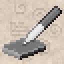

# InkingCraft
_Play Minecraft with your graphics tablet! (sort of)_

## Features
- Graphics tablet inputs (pen absolute position, pen pressure, pen tilting, etc...)
- _More to come!_

## Planned features
- [ ] Buttons binding
- [ ] Translate tablet inputs to player's camera controls

## Installing InkingCraft (as of Feb 29th, 2024)
1. Clone [Inking](https://github.com/nahkd123/inking) repository and this repository.
1. Install Inking to Maven local repository: `cd inking && mvn install`. This will build natives for current platform only (blame .NET NativeAOT).
1. Install InkingCraft to Maven local repository: `cd ../inkingcraft && mvn install`. This will install InkingCraft to local repository so you can use InkingCraft as dependency. It will also build the mod, which can be installed in your `mods/` folder (InkingCraft is a client-side mod so there is no need to install on server).
1. Enjoy!

## Handling inputs
There are 5 different ways to handle inputs with InkingCraft:
1. Handle unfiltered packets through `TabletPacketsCallback`, which will call your callbacks in **input thread** (yes it is multithreaded so beware).
1. Handle filtered packets through `TabletPacketsCallback` (still call callbacks in input thread).
1. Handle packets in your GUI widget (by implementing `TabletElement` interface). Contains both sync and async methods.
1. Read the current pointer position in `InkingInputManager` (contains pointer's last received packet).
1. Register your callback directly to `Tablet` from `Inking`, which also call your callback in input thread.

## License
MIT license.